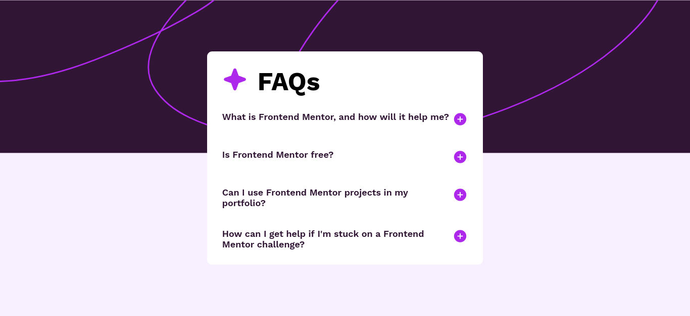

# Frontend Mentor - FAQ accordion solution

This is a solution to the [FAQ accordion challenge on Frontend Mentor](https://www.frontendmentor.io/challenges/faq-accordion-wyfFdeBwBz). Frontend Mentor challenges help you improve your coding skills by building realistic projects. 

## Table of contents

- [Overview](#overview)
  - [The challenge](#the-challenge)
  - [Screenshot](#screenshot)
  - [Links](#links)
- [My process](#my-process)
  - [Built with](#built-with)
  - [What I learned](#what-i-learned)
  - [Continued development](#continued-development)
- [Author](#author)


## Overview

### The challenge

Users should be able to:

- Hide/Show the answer to a question when the question is clicked
- View the optimal layout for the interface depending on their device's screen size
- See hover and focus states for all interactive elements on the page

### Screenshot




### Links

- Solution URL: [Add solution URL here](https://www.frontendmentor.io/solutions/faq-accordion-hCNYeFYZnb)
- Live Site URL: [Add live site URL here](https://faq-accordion-six-eta.vercel.app/)

## My process

### Built with

- Semantic HTML5 markup
- CSS custom properties
- Flexbox
- Mobile-first workflow
- JS

### What I learned

```html
<h1>I've learned to manage the DOM more effectively, so I anticipate enhancing my skills.</h1>
```
```css
.proud-of-this-css {
  color: papayawhip;
}
```
```js
const proudOfThisFunc = () => {
  console.log('🎉')
}
```
### Continued development

In the future, I aim to master DOM manipulation skills.


## Author

- Frontend Mentor - [@INSolisLoyo](https://www.frontendmentor.io/profile/INSolisLoyo)
- LinkedIn - [@irma-nohemi-solis-loyo](https://www.linkedin.com/in/irma-nohemi-solis-loyo/)


